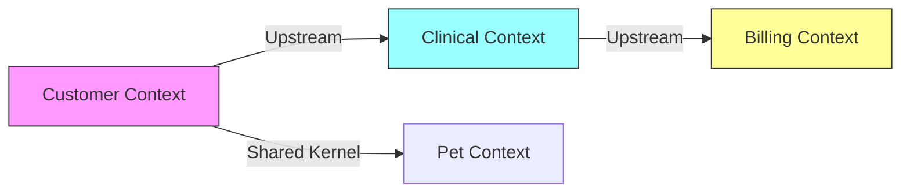

# 도메인 경계 식별 단계별 가이드
## DDD와 이벤트 스토밍을 활용한 마이크로서비스 경계 찾기

---

## 📋 개요

마이크로서비스로 분리하기 전 가장 중요한 작업은 **올바른 도메인 경계를 찾는 것**입니다.
잘못된 경계는 서비스 간 높은 결합도와 복잡한 분산 트랜잭션을 야기합니다.

### 핵심 개념 관계도
```
Event Storming (이벤트 찾기)
        ↓
Domain Events (비즈니스 이벤트 도출)
        ↓
Bounded Context (경계 식별)
        ↓
Context Mapping (관계 정의)
        ↓
Service Boundaries (서비스 경계 확정)
```

---

## 🎯 Step 1: 이벤트 스토밍 (Event Storming)

### 1.1 준비물
- 🟠 **주황색 포스트잇**: 도메인 이벤트 (과거형 동사)
- 🔵 **파란색 포스트잇**: 커맨드 (동사)
- 🟡 **노란색 포스트잇**: 액터 (사용자/시스템)
- 🟣 **보라색 포스트잇**: 정책/규칙
- 🟢 **초록색 포스트잇**: 외부 시스템

### 1.2 Pet Clinic 이벤트 도출

#### Round 1: 브레인스토밍 (무작위로 이벤트 나열)
```
🟠 Owner Registered (고객이 등록됨)
🟠 Pet Added (반려동물이 추가됨)
🟠 Visit Scheduled (방문이 예약됨)
🟠 Visit Completed (방문이 완료됨)
🟠 Vet Assigned (수의사가 배정됨)
🟠 Treatment Performed (치료가 수행됨)
🟠 Invoice Created (청구서가 생성됨)
🟠 Payment Received (결제가 수신됨)
🟠 Vaccination Recorded (예방접종이 기록됨)
🟠 Medical History Updated (의료 기록이 업데이트됨)
```

#### Round 2: 시간순 정렬
```
Timeline →
─────────────────────────────────────────────────────────────>
[Owner Registered] → [Pet Added] → [Visit Scheduled] → 
[Vet Assigned] → [Visit Started] → [Treatment Performed] → 
[Visit Completed] → [Invoice Created] → [Payment Received]
```

#### Round 3: 커맨드와 액터 추가
```
🟡 Customer          🔵 Register Owner      🟠 Owner Registered
                     🔵 Add Pet             🟠 Pet Added
                     🔵 Schedule Visit       🟠 Visit Scheduled

🟡 Receptionist      🔵 Assign Vet          🟠 Vet Assigned

🟡 Vet               🔵 Start Visit         🟠 Visit Started
                     🔵 Perform Treatment   🟠 Treatment Performed
                     🔵 Complete Visit      🟠 Visit Completed

🟡 System            🔵 Generate Invoice    🟠 Invoice Created
```

---

## 🔍 Step 2: Aggregate 식별

### 2.1 이벤트 그룹핑
이벤트들을 관련성에 따라 그룹으로 묶습니다.

#### Group A: Customer Management
```
📦 Owner Aggregate
   ├─ Owner Registered
   ├─ Owner Updated
   └─ Owner Deleted

📦 Pet Aggregate
   ├─ Pet Added
   ├─ Pet Updated
   └─ Pet Removed
```

#### Group B: Veterinary Care
```
📦 Vet Aggregate
   ├─ Vet Registered
   ├─ Vet Schedule Updated
   └─ Specialization Added

📦 Visit Aggregate
   ├─ Visit Scheduled
   ├─ Visit Started
   ├─ Treatment Performed
   └─ Visit Completed
```

#### Group C: Billing
```
📦 Invoice Aggregate
   ├─ Invoice Created
   ├─ Payment Received
   └─ Invoice Cancelled
```

### 2.2 불변식(Invariants) 정의

각 Aggregate의 비즈니스 규칙을 정의합니다:

```
Owner Aggregate 규칙:
✓ Owner는 최소 1개의 연락처 정보 필요
✓ Owner 삭제 시 관련 Pet도 함께 처리

Pet Aggregate 규칙:
✓ Pet은 반드시 Owner가 있어야 함
✓ 동일 Owner의 Pet 이름 중복 불가

Visit Aggregate 규칙:
✓ Visit는 Pet과 Vet이 모두 확정되어야 시작 가능
✓ 동일 시간에 Vet은 하나의 Visit만 가능
```

---

## 🌐 Step 3: Bounded Context 식별

### 3.1 언어 경계 (Ubiquitous Language) 찾기

각 컨텍스트에서 사용하는 용어를 분석합니다:

| 용어 | Customer Context | Clinical Context | Billing Context |
|------|------------------|------------------|-----------------|
| Customer | "Owner" (주인) | "Client" (고객) | "Payer" (납부자) |
| Pet | "My Pet" (내 반려동물) | "Patient" (환자) | N/A |
| Visit | "Appointment" (약속) | "Consultation" (진료) | "Service" (서비스) |
| Vet | "Doctor" (의사) | "Practitioner" (의료진) | "Provider" (제공자) |

**🔍 발견**: 같은 개념이 다른 용어로 불림 → 다른 Bounded Context!

### 3.2 Bounded Context 도출

```
┌─────────────────────────────────────────────────────────┐
│                    Pet Clinic System                     │
│                                                          │
│  ┌──────────────────┐  ┌──────────────────┐           │
│  │ Customer Context │  │ Clinical Context │           │
│  │                  │  │                  │           │
│  │ • Owner         │  │ • Vet           │           │
│  │ • Pet           │  │ • Visit         │           │
│  │ • Contact Info  │  │ • Treatment     │           │
│  └──────────────────┘  └──────────────────┘           │
│                                                          │
│  ┌──────────────────┐  ┌──────────────────┐           │
│  │ Billing Context  │  │ Inventory Context│           │
│  │                  │  │                  │           │
│  │ • Invoice       │  │ • Medicine      │           │
│  │ • Payment       │  │ • Stock         │           │
│  │ • Pricing       │  │ • Order         │           │
│  └──────────────────┘  └──────────────────┘           │
└─────────────────────────────────────────────────────────┘
```

---

## 🗺️ Step 4: Context Mapping

### 4.1 컨텍스트 간 관계 분석



### 4.2 통합 패턴 정의

| 관계 | 패턴 | 설명 |
|------|------|------|
| Customer → Clinical | **Customer-Supplier** | Customer가 Pet 정보를 제공, Clinical이 소비 |
| Clinical → Billing | **Customer-Supplier** | Clinical이 진료 정보 제공, Billing이 청구서 생성 |
| Customer ↔ Pet | **Shared Kernel** | 강한 결합, 같은 서비스로 |
| Clinical → Inventory | **Anticorruption Layer** | 복잡한 변환 로직 필요 |

### 4.3 인터페이스 정의

```typescript
// Customer Context → Clinical Context
interface PetInfo {
    petId: string
    name: string
    species: string
    breed: string
    age: number
    ownerId: string
}

// Clinical Context → Billing Context
interface TreatmentRecord {
    visitId: string
    petId: string
    treatments: Treatment[]
    totalAmount: number
    date: Date
}
```

---

## 📊 Step 5: 데이터 분석

### 5.1 데이터 소유권 매트릭스

| 데이터 | Customer | Clinical | Billing | 소유자 결정 |
|--------|----------|----------|---------|-------------|
| Owner 정보 | ✅ Create/Update | 🔍 Read | 🔍 Read | **Customer** |
| Pet 정보 | ✅ Create/Update | 🔍 Read | ❌ | **Customer** |
| Visit 기록 | ❌ | ✅ Create/Update | 🔍 Read | **Clinical** |
| 진료 내역 | ❌ | ✅ Create/Update | 🔍 Read | **Clinical** |
| 청구서 | ❌ | ❌ | ✅ Create/Update | **Billing** |

### 5.2 데이터 의존성 그래프

```
Owner (Customer)
   ↓ 1:N
Pet (Customer)
   ↓ 1:N
Visit (Clinical) ← Vet (Clinical)
   ↓ 1:1
Invoice (Billing)
```

---

## 🎯 Step 6: 분리 우선순위 결정

### 6.1 평가 기준 매트릭스

| 서비스 후보 | 독립성 | 변경 빈도 | 비즈니스 가치 | 기술 복잡도 | **총점** |
|-------------|--------|-----------|---------------|------------|----------|
| Customer Service | ⭐⭐⭐⭐⭐ | ⭐⭐⭐ | ⭐⭐⭐⭐ | ⭐⭐ | **14/20** |
| Clinical Service | ⭐⭐⭐ | ⭐⭐⭐⭐⭐ | ⭐⭐⭐⭐⭐ | ⭐⭐⭐⭐ | **17/20** |
| Billing Service | ⭐⭐⭐⭐ | ⭐⭐ | ⭐⭐⭐ | ⭐⭐ | **11/20** |

### 6.2 Risk-Value 매트릭스

```
        High Value
            ↑
    ┌───────┼───────┐
    │   🟢  │  🔴   │
    │Customer│Clinical│
    │       │       │
    ├───────┼───────┤
    │   🟡  │  🟢   │
    │Inventory│Billing│
    │       │       │
    └───────┴───────┘
    Low Risk → High Risk
```

### 6.3 최종 분리 전략

#### Phase 1: Customer Service (Low Risk, High Value)
```
✅ Owner + Pet 통합
✅ 독립적 데이터
✅ 단순한 CRUD
✅ 다른 서비스에 영향 최소
```

#### Phase 2: Vet Service (Medium Risk, Medium Value)  
```
✅ 독립적 도메인
✅ Visit와 약한 결합
⚠️ 스케줄 관리 복잡도
```

#### Phase 3: Clinical Service (High Risk, High Value)
```
⚠️ 복잡한 비즈니스 로직
⚠️ 여러 서비스와 통신 필요
✅ 비즈니스 가치 높음
```

#### Phase 4: Billing Service (Low Risk, Low Value)
```
✅ 명확한 경계
⚠️ 트랜잭션 처리
⚠️ 외부 결제 시스템 연동
```

---

## 🔄 Step 7: 반복 검증

### 7.1 What-If 시나리오

**시나리오 1**: "새로운 고객이 반려동물과 함께 첫 방문 예약"
```
1. Customer Service: Owner 등록 → Pet 등록
2. Clinical Service: Visit 예약 (Pet ID 참조)
3. Clinical Service: Vet 배정
✅ 서비스 간 명확한 경계, API 호출로 처리 가능
```

**시나리오 2**: "진료 완료 후 청구서 발행"
```
1. Clinical Service: Visit 완료 이벤트 발행
2. Billing Service: 이벤트 수신 → Invoice 생성
3. Customer Service: Owner 정보 조회 (API)
✅ 이벤트 기반 통신, 느슨한 결합
```

### 7.2 Anti-Pattern 체크리스트

❌ **Chatty Services**: 하나의 작업에 과도한 서비스 간 통신
```
Bad: Visit 생성 시 5번의 API 호출
Good: 필요 정보를 미리 캐싱 또는 이벤트로 전달
```

❌ **Distributed Monolith**: 서비스들이 동시에 배포되어야 함
```
Bad: Customer와 Clinical이 항상 함께 배포
Good: API 버저닝으로 독립적 배포
```

❌ **Data Inconsistency**: 분산 트랜잭션 필요
```
Bad: Owner 삭제 시 모든 Visit도 삭제 (분산 트랜잭션)
Good: Soft Delete + 이벤트 기반 정리
```

---

## 📝 Step 8: 실행 계획 수립

### 8.1 마이그레이션 로드맵

```
Month 1-2: Customer Service
├─ Week 1-2: 도메인 모델 구현
├─ Week 3-4: API 개발
├─ Week 5-6: Gateway 통합
└─ Week 7-8: 안정화 & 모니터링

Month 3-4: Vet Service
├─ Week 1-2: 서비스 개발
├─ Week 3-4: 스케줄 기능
└─ Week 5-8: 통합 테스트

Month 5-6: Clinical Service
├─ Week 1-4: 복잡한 비즈니스 로직
├─ Week 5-6: 서비스 간 통신
└─ Week 7-8: 성능 최적화
```

### 8.2 성공 지표 (KPI)

| 지표 | 목표 | 측정 방법 |
|------|------|-----------|
| 독립 배포 빈도 | 주 2회 이상 | CI/CD 파이프라인 |
| 서비스 간 결합도 | API 호출 < 3회/트랜잭션 | APM 도구 |
| 응답 시간 | < 200ms (P95) | 모니터링 |
| 장애 격리 | 타 서비스 영향 없음 | Chaos Engineering |

---

## 🎓 핵심 교훈

### ✅ DO (해야 할 것)
1. **비즈니스 언어부터 시작**: 기술이 아닌 비즈니스 도메인 중심
2. **작게 시작**: 가장 독립적인 서비스부터
3. **이벤트 중심 사고**: 무엇이 "일어났는가"에 집중
4. **팀과 함께**: 개발자뿐 아니라 도메인 전문가 참여
5. **반복적 개선**: 한 번에 완벽할 수 없음

### ❌ DON'T (하지 말아야 할 것)
1. **기술 레이어로 분리**: Controller/Service/Repository는 경계가 아님
2. **데이터베이스 테이블 = 서비스**: 물리적 구조에 종속 금지
3. **너무 작게 쪼개기**: Nano Service는 관리 부담만 증가
4. **완벽주의**: 80% 수준에서 시작하고 개선
5. **팀 구조 무시**: Conway's Law를 고려하지 않음

---

## 📚 실습 워크시트

### Workshop 1: 우리 시스템의 이벤트 찾기
```
시간: 30분
준비물: 포스트잇, 화이트보드

1. 각자 10개의 도메인 이벤트 작성 (5분)
2. 팀별로 모아서 중복 제거 (10분)
3. 시간순으로 정렬 (10분)
4. 그룹핑 및 Aggregate 도출 (5분)
```

### Workshop 2: Bounded Context 그리기
```
시간: 20분

1. 각 Aggregate를 원으로 그리기
2. 관련 있는 것끼리 가까이 배치
3. 경계선 그리기
4. 각 Context의 이름 붙이기
```

### Workshop 3: 우선순위 투표
```
시간: 10분

1. 각 Context에 점수 부여
   - 독립성 (1-5점)
   - 비즈니스 가치 (1-5점)
   - 기술 난이도 (1-5점)
2. 총점 계산
3. 분리 순서 결정
```

---

## 🔗 다음 단계

이제 도메인 경계를 식별했으니, 실제 코드 분리를 시작할 수 있습니다:

1. **Strangler Pattern 적용**: 식별된 경계를 기준으로 점진적 분리
2. **API 설계**: 서비스 간 인터페이스 정의
3. **데이터 마이그레이션**: 단계적 DB 분리
4. **이벤트 버스 구축**: 비동기 통신 인프라
5. **모니터링 체계**: 분산 시스템 관측성 확보

---

**Remember**: 완벽한 경계는 없습니다. 지속적으로 학습하고 개선하는 것이 중요합니다! 🚀